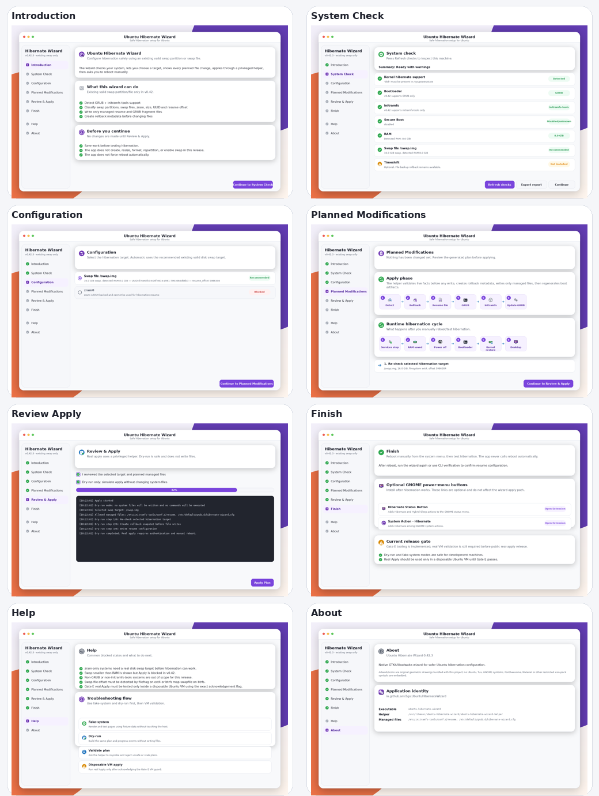

# Ubuntu Hibernate Wizard

<p align="center">
  
</p>

<p align="center">
  <strong>Safety-first GTK4/libadwaita wizard for enabling hibernation on Ubuntu with an existing persistent swap target.</strong>
</p>

<p align="center">
  <a href="https://ami3go.github.io/ubuntu-hibernate-wizard/">Documentation</a> ·
  <a href="https://ami3go.github.io/ubuntu-hibernate-wizard/installation/">Installation</a> ·
  <a href="https://ami3go.github.io/ubuntu-hibernate-wizard/usage/">Usage</a> ·
  <a href="https://ami3go.github.io/ubuntu-hibernate-wizard/troubleshooting/">Troubleshooting</a>
</p>

> **Current status:** v0.42.12 is a developer/test release with restored managed /swap.img sizing controls. Gate D has passed, Gate E/F tooling exists, but real disposable-VM hibernate/resume validation is still required before public real-apply release.



## Why this exists

Ubuntu can hibernate, but a working setup often needs several exact pieces to match:

- a persistent swap partition or swap file large enough for RAM;
- a stable resume UUID;
- a correct swap-file `resume_offset` when the target is a file;
- initramfs resume configuration;
- GRUB kernel parameters;
- safe rollback when boot configuration changes.

Ubuntu Hibernate Wizard turns that process into a reviewable wizard. It detects the current system state, classifies hibernation targets, shows the exact planned changes, and applies only a small allowlisted set of configuration updates through a polkit helper.

## Supported in v0.42

| Area | Supported |
|---|---|
| Desktop | Ubuntu/GNOME style desktop using GTK4 + libadwaita |
| Boot stack | GRUB + initramfs-tools |
| Swap partition | Existing active persistent swap partition with stable UUID and size >= RAM |
| Swap file | Existing active ext4 swap file with reliable `filefrag` offset, or btrfs swap file when `btrfs inspect-internal map-swapfile -r` succeeds |
| zram | Detected and blocked as a hibernation target |
| Secure Boot | Detected and warned; not changed |
| Apply path | Managed resume file + managed GRUB fragment only |
| Reboot | Manual text notice only; no reboot button |

Postponed or unsupported in v0.42: swap creation, swap resizing, inactive swap enabling, `/etc/fstab` swap management, partition formatting, repartitioning, systemd-boot, dracut, UKI, random-key encrypted swap, unknown mapper swap, automatic encrypted-hibernation setup, removable-media swap, and automatic reboot.

## Managed files

Real Apply may write only these files:

```text
/etc/initramfs-tools/conf.d/resume
/etc/default/grub.d/hibernate-wizard.cfg
```

The wizard must not blindly rewrite `/etc/default/grub`, must not remove user-created GRUB options, and must not edit arbitrary bootloader files. Existing conflicting `resume=`, `resume_offset=`, or `RESUME=` configuration blocks Apply until reviewed.

## Safety model

The GUI is not run as root. Real changes use a narrow helper:

```text
pkexec /usr/libexec/ubuntu-hibernate-wizard/ubuntu-hibernate-wizard-helper --action apply-plan --stdin-json
```

The helper validates the request schema, re-probes and reclassifies the live system, rejects unknown fields and duplicate steps/files, uses fixed command arrays, and never executes arbitrary shell strings.

## Install

From a release `.deb`:

```bash
sudo apt install ./ubuntu-hibernate-wizard_*.deb
```

Required runtime packages:

```text
python3 (>= 3.11), python3-gi, gir1.2-gtk-4.0, gir1.2-adw-1,
pkexec, polkitd, initramfs-tools, grub-common, util-linux, e2fsprogs
```

## Run safely from source

```bash
git clone https://github.com/ami3go/ubuntu-hibernate-wizard.git
cd ubuntu-hibernate-wizard
PYTHONPATH=. python3 -m ubuntu_hibernate_wizard.main --dry-run
```

Use a fake system profile without probing or changing the host:

```bash
PYTHONPATH=. python3 -m ubuntu_hibernate_wizard.main \
  --dry-run \
  --fake-system tests/fixtures/fake_systems/swapfile_ok
```

Run tests and build a Debian package:

```bash
make test
make deb
```


## Public-use hardening in v0.42.8

This package includes the production-readiness correction set:

- fake-system fixtures with golden expected outputs;
- conservative encrypted-swap detection using crypttab, mapper, lsblk, and dmsetup evidence;
- Diagnostic ZIP export with redaction;
- GTK smoke tests for Ubuntu CI;
- static safety checks against direct protected-file writes;
- complete 8-step runtime documentation.

Diagnostic exports are ZIP files named `ubuntu-hibernate-wizard-diagnostics-YYYYMMDD-HHMMSS.zip`. See `docs/diagnostics.md` for included files and privacy redaction rules.

## Typical workflow

1. Launch **Ubuntu Hibernate Wizard**.
2. Run **System Check**.
3. Select an existing valid swap partition or swap file.
4. Review **Planned Modifications**.
5. Run dry-run first.
6. Apply only after reviewing the plan.
7. Reboot manually from the desktop/system menu.
8. Verify resume configuration after reboot.

## Useful commands

```bash
ubuntu-hibernate-wizard --verify
ubuntu-hibernate-wizard --gate-e-preflight
ubuntu-hibernate-wizard --gate-e-dry-run
```

Gate E/F release validation commands are documented in:

- [Gate E disposable VM validation](docs/gate-e-vm-validation.md)
- [Gate F release-candidate evidence check](docs/gate-f-release-candidate.md)

## Documentation

The GitHub Pages site is built with MkDocs:

- [Installation](docs/installation.md)
- [Usage](docs/usage.md)
- [Screenshots and examples](docs/screenshots-and-examples.md)
- [How hibernation works](docs/how-hibernation-works.md)
- [Troubleshooting](docs/troubleshooting.md)
- [Rollback and recovery](docs/rollback-and-recovery.md)
- [Architecture and safety model](docs/architecture.md)
- [GitHub Pages deployment notes](docs/github-pages.md)

## License and assets

Code is licensed under **GPL-3.0-or-later**.

Bundled icon assets are original geometric drawings made for this project. They intentionally avoid Ubuntu logo marks, Tux, GNOME symbolic icons, FontAwesome, Material Icons, and other license-limited symbol sets.


## v0.42.12 managed swap-file sizing

The Configuration step includes a RAM-based slider with marks for Minimum, Recommended, and 2× RAM, plus preset buttons and manual GiB input.


The Configuration step again provides a swap-size slider, three suggested size buttons, and a manual GiB input for managed `/swap.img` creation/resizing. The real apply path still runs through the privileged helper, creates rollback metadata, validates the live swap-file UUID and resume offset, and shows the operation in Planned Modifications before writing boot configuration.
