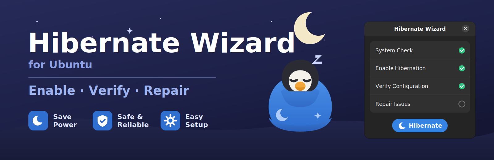

<p align="center">
  
</p>

# Hibernate Wizard for Ubuntu

A safe, friendly GTK4 wizard that **enables, verifies, and repairs hibernation** on Ubuntu — including the notorious stale `resume_offset` problem that silently breaks resume after a swap file is resized or recreated.

## Why this exists

Enabling hibernation on Ubuntu with a swap **file** requires two magic values on the kernel command line — the filesystem UUID and the swap file's physical offset:

```
resume=UUID=d76e67b3-...  resume_offset=5986304
```

Get either wrong (or let them go stale) and the system simply cold-boots instead of resuming. This wizard automates the whole procedure with dry-run plans, backups, one-click rollback, and post-reboot verification.

## Features

- **Guided setup** — system compatibility check, swap creation/resize, GRUB + initramfs configuration, all shown as a reviewable plan before anything runs
- **Crash-safe swap resize** — build-aside + atomic replace with a recovery journal; a power loss can never leave you swapless
- **One password prompt per run** — a single pkexec-elevated helper session, never a prompt per step
- **Post-reboot verification & one-click repair** — detects UUID/offset drift and fixes it
- **Boot-time health guard** *(v1.1)* — notifies you if a kernel update or fsck silently breaks the configuration
- **CLI mode** *(v1.2)* — `sudo ubuntu-hibernate-wizard --verify --json` for scripts and monitoring
- **Full rollback** — every modified file is backed up and restorable

## Supported systems

| Requirement | Supported |
|---|---|
| Ubuntu | 24.04 LTS, 26.04 LTS (interim releases with warning) |
| Filesystem | ext4 root with swap **file** |
| Bootloader | GRUB + initramfs-tools |
| Desktop | GNOME (GTK4/libadwaita UI) |
| Secure Boot | Detected; advanced-mode confirmation required |

Btrfs, LUKS-encrypted swap, swap partitions, and systemd-boot are on the [roadmap](docs/faq.md).

## Install

Download the `.deb` from the latest release, then:

```bash
sudo apt install ./ubuntu-hibernate-wizard_*.deb
```

Launch **Hibernate Wizard** from the app grid, or see the [usage guide](docs/usage.md).

## Build from source

```bash
make test   # run the unit test suite (no root, no system changes)
make deb    # build the .deb package into dist/
```

Dependencies for running: `python3 (>= 3.11)`, `python3-gi`, `gir1.2-gtk-4.0`, `gir1.2-adw-1`, `pkexec`, `polkitd`.

## Documentation

- [Usage guide](docs/usage.md) — step-by-step walkthrough
- [How hibernation works](docs/how-hibernation-works.md) — UUID + offset explained
- [Troubleshooting](docs/troubleshooting.md) — every error code, with fixes
- [Rollback & recovery](docs/rollback-and-recovery.md)
- [Architecture](docs/architecture.md) — GUI ↔ privileged helper security model
- [Full engineering specification](spec/ubuntu_hibernate_wizard_task.md) (v1.8)

## Safety model in one paragraph

The GUI never runs privileged commands itself. A separate root helper is launched once per run via pkexec, accepts only a fixed set of validated subcommands, and refuses any mutation that is not part of the plan you approved on screen. Every changed file is backed up first; every change can be rolled back; nothing is modified during package installation.

## License

GPL-3.0-or-later. Artwork (banner, icon) is original and CC-BY-4.0.
