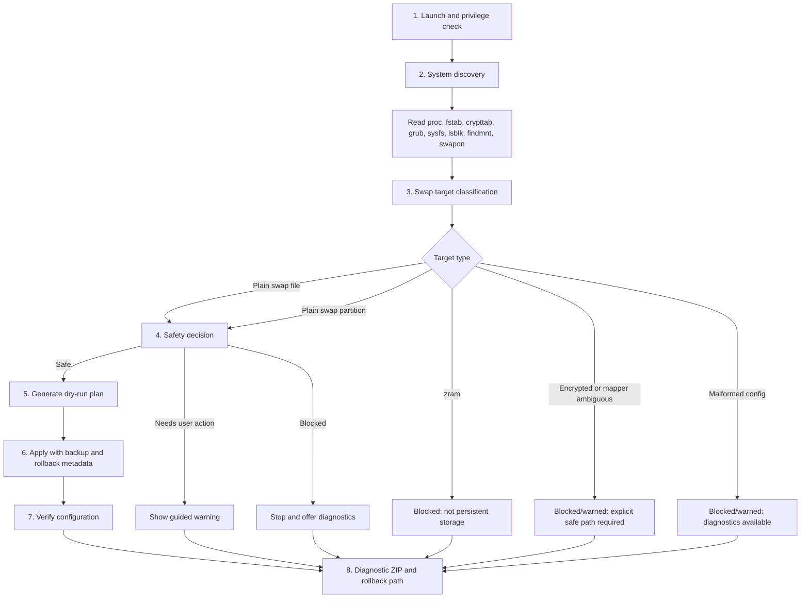

# How Ubuntu hibernation works

Hibernation saves the current RAM image to persistent swap and powers off. During the next boot, the kernel and initramfs must know where to find that saved image.

Ubuntu Hibernate Wizard v0.42.8 is intentionally conservative: it uses an existing active persistent swap partition/swap file or prepares managed `/swap.img` through the reviewed helper flow. It does not repartition disks or reboot automatically.

## 8-step runtime flow



## Read-only discovery sources

The wizard may read these during discovery:

```text
/proc/swaps
/proc/meminfo
/etc/fstab
/etc/crypttab
/etc/default/grub
/sys/power/state
/sys/power/resume
lsblk
findmnt
swapon --show
dmsetup info, when available
filefrag, for ext4 swap-file offset validation
btrfs inspect-internal map-swapfile -r, for btrfs swap-file offset validation
```

Discovery is non-destructive and should not require root just to open the GUI.

## Files changed only after confirmation

Real Apply may modify only reviewed planned outputs, through the privileged helper and rollback executor:

```text
/etc/initramfs-tools/conf.d/resume
/etc/default/grub.d/hibernate-wizard.cfg
rollback metadata under the wizard backup/state directory
```

The wizard does not blindly rewrite `/etc/default/grub` and does not edit arbitrary bootloader files. It writes a managed GRUB fragment and regenerates boot artifacts with fixed allowlisted commands.

## Swap partition case

For a swap partition, the important value is a stable resume identifier:

```text
resume=UUID=<swap-partition-uuid>
```

The initramfs resume configuration commonly contains:

```text
RESUME=UUID=<swap-partition-uuid>
```

## Swap file case

For a swap file, the kernel also needs the physical offset of the file on disk:

```text
resume=UUID=<backing-filesystem-uuid> resume_offset=<offset>
```

On ext4, the wizard validates the first physical extent from `filefrag`. On btrfs, it requires:

```bash
btrfs inspect-internal map-swapfile -r <swapfile>
```

## Why zram cannot be used

zram stores compressed swap in RAM. It is useful while the machine is running, but it disappears when power is off. Hibernation requires persistent storage, so zram is always blocked as a hibernation target.

## Encrypted swap policy

Encrypted swap is blocked by default for automatic hibernation configuration unless a future release implements and tests a safe resume path for the exact encryption model.

The wizard detects and blocks or warns for these cases:

- `/etc/crypttab` random-key swap using `/dev/urandom`, `/dev/random`, `none`, or `swap`/`random` options.
- Active `/dev/mapper/*` swap whose backing cannot be proven safe.
- dm-crypt/LUKS mapper swap detected through `lsblk`, `/etc/crypttab`, or `dmsetup`.
- Persistent encrypted swap that would require a known initramfs resume mapping path.

A plain swap file located on an encrypted root filesystem is classified separately as a swap file on encrypted root. It is not treated as an encrypted swap block device, but it still must pass swap-file offset and resume validation.

## Why GRUB and initramfs must both be updated

GRUB provides kernel command-line parameters such as `resume=...` and `resume_offset=...`. initramfs-tools provides early boot resume configuration. If either one is stale, the computer may cold-boot instead of resuming.

Ubuntu Hibernate Wizard v0.42.12 detects existing active swap targets or prepares managed `/swap.img`, then writes resume configuration only after review.
