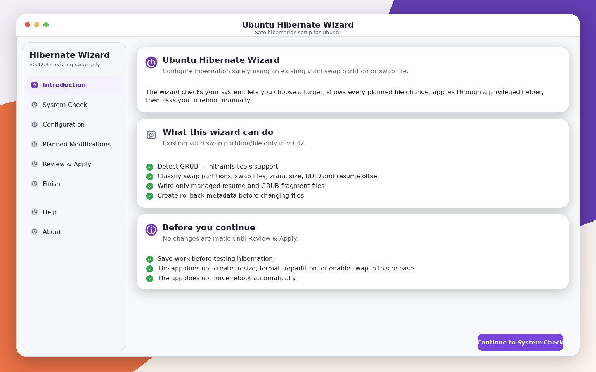
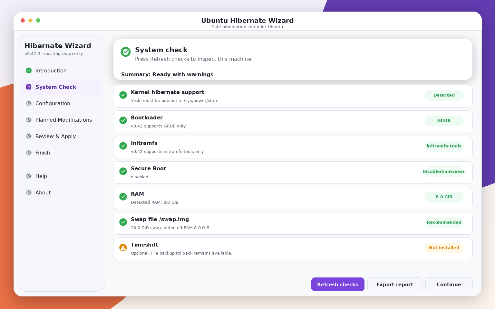
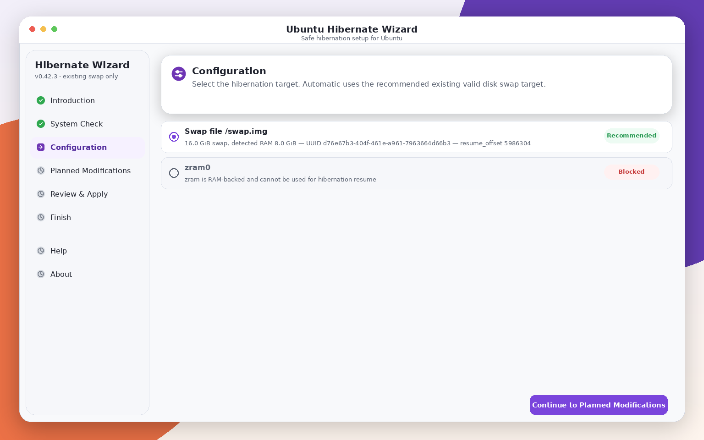
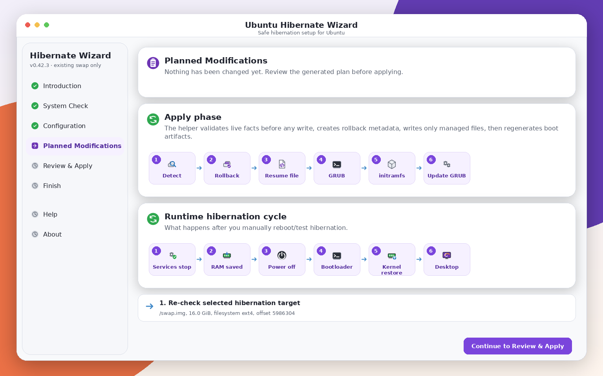
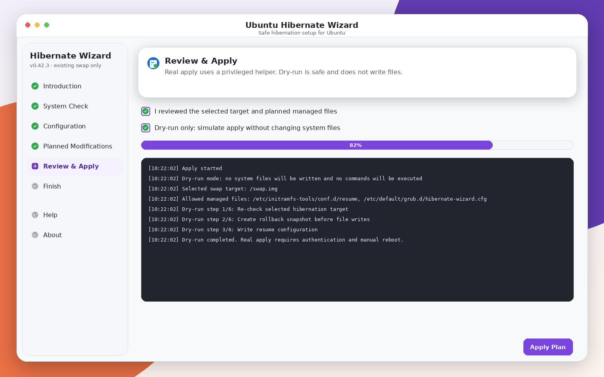
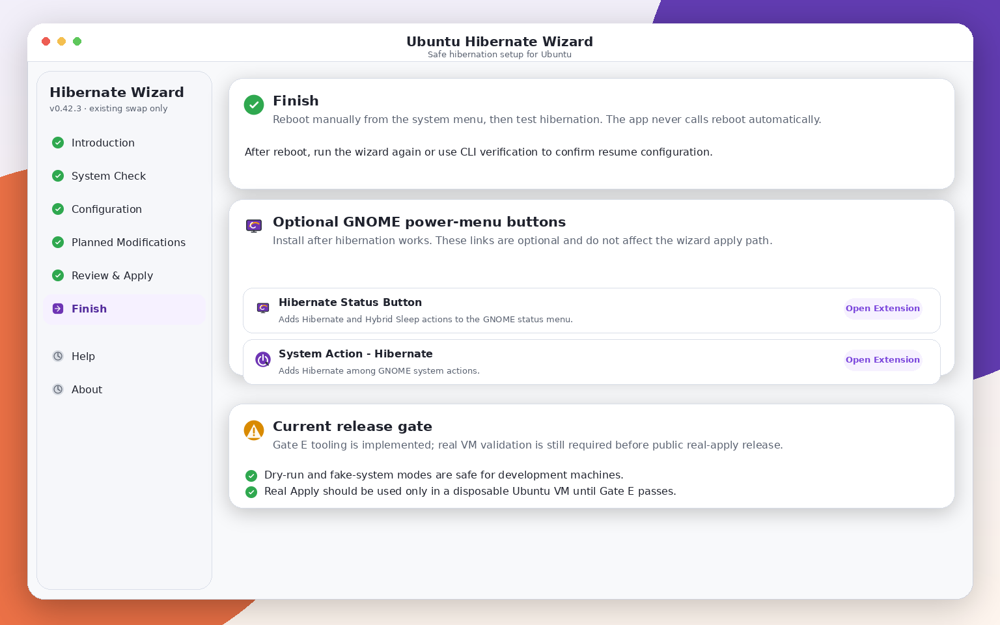
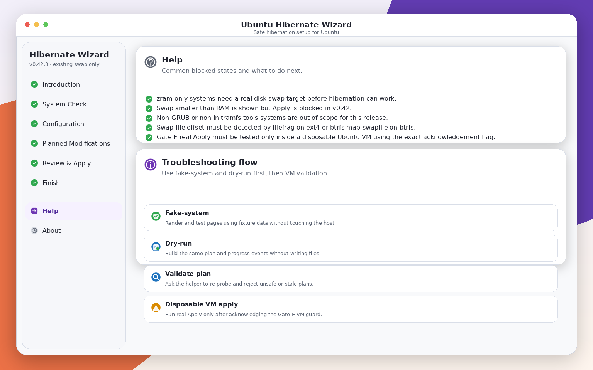
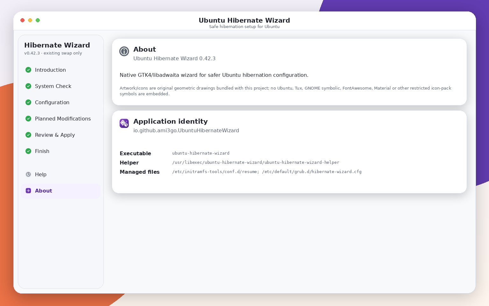

# Screenshots and examples

These screenshots show the v0.42 GTK4/libadwaita workflow: check the system, choose an **existing active** swap partition/file, review managed file changes, apply through the helper, and reboot manually.

## Complete menu overview


## Introduction

The start page explains the conservative v0.42 scope: existing valid swap targets only, no swap creation/resizing, no storage changes, and no automatic reboot.



## System Check

System Check probes the host without starting a privileged helper. It checks active swap, GRUB, initramfs-tools, Secure Boot/lockdown, and existing resume configuration.



## Configuration

The Configuration page lists existing active swap targets and explains why each target is recommended, valid, warned, or blocked.



## Planned modifications

The plan lists the exact managed files and commands before authentication.



Example plan for an existing ext4 swap file:

```text
1. Re-check selected hibernation target: /swap.img, ext4, offset 5986304
2. Create rollback metadata before file writes
3. Write /etc/initramfs-tools/conf.d/resume
4. Write /etc/default/grub.d/hibernate-wizard.cfg
5. Run update-initramfs -u
6. Run update-grub
```

## Review and Apply

Dry-run mode is safe and does not write files. Real apply streams structured helper events.



Example dry-run excerpt:

```text
[12:03:01] Dry-run mode: no system files will be written and no commands will be executed
[12:03:02] Selected swap target: /swap.img
[12:03:03] Allowed managed files: /etc/initramfs-tools/conf.d/resume, /etc/default/grub.d/hibernate-wizard.cfg
[12:03:04] Dry-run step 5/6: Run update-initramfs -u
[12:03:05] Dry-run step 6/6: Run update-grub
```

## Finish

The Finish page tells the user to reboot manually and suggests optional GNOME hibernate menu extensions after the operating-system side works.



## Help and About





## Verify after reboot

```bash
ubuntu-hibernate-wizard --verify
```

Useful support commands:

```bash
swapon --show --bytes
cat /proc/cmdline
cat /etc/initramfs-tools/conf.d/resume
cat /etc/default/grub.d/hibernate-wizard.cfg
```

For swap files:

```bash
findmnt -no SOURCE,FSTYPE,UUID -T /swap.img
sudo filefrag -v /swap.img | awk '$1=="0:" {print $4}'
```

For btrfs swap files:

```bash
sudo btrfs inspect-internal map-swapfile -r /swap.img
```

## Rollback preview

Rollback is manifest-backed and conservative. It restores/removes only files that the snapshot proves are safe.

```bash
ubuntu-hibernate-wizard --list-rollbacks
ubuntu-hibernate-wizard --preview-rollback 20260705-180000-a1b2c3
```

Example output:

```text
Rollback preview for 20260705-180000-a1b2c3
1. will-run: restore-file /etc/default/grub.d/hibernate-wizard.cfg
2. will-run: remove-created-file /etc/initramfs-tools/conf.d/resume
```
