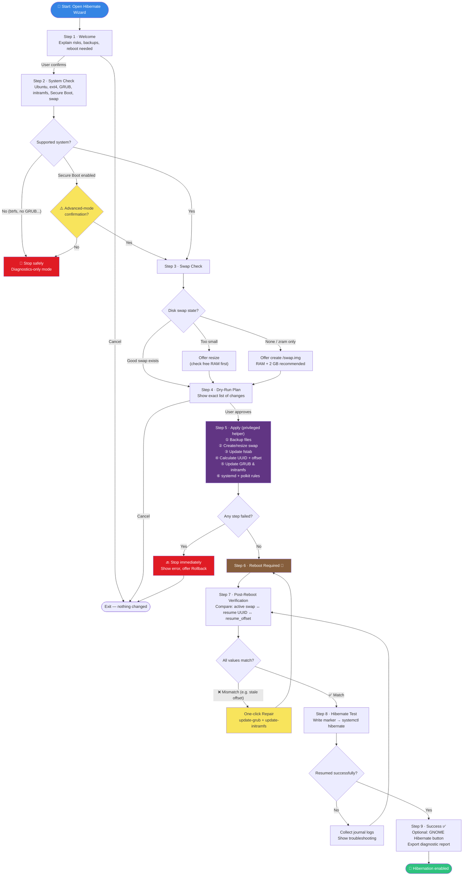

# Ubuntu Hibernate Wizard — AI Implementation Task Specification

**Document version:** 1.8  
**Changes in 1.8 (sufficiency-audit fixes):** Specified the root-guard → user-notification bridge (§27.1); added v1.1 files to the packaging layout and purge rules (§17.2–17.3); resolved CLI elevation (§27.7); added `swap_preexisting` provenance to the state schema (Step 7); §12 gains a v1.1 test block; §13 notes per-subsection acceptance for §27.  
**Changes in 1.7:** Added §27 User-Value Feature Roadmap: boot-time health guard, battery-critical hibernate, power-behavior page, clean uninstall, resume-failure autopsy, one-click bug report, and CLI mode — each with milestone assignment and concrete requirements. §19 updated with the remaining ideas.  
**Changes in 1.6:** Expanded §16 into full documentation deliverables (§16.3), a mandatory GitHub repository structure (§16.4), and a GitHub Pages project site published from `docs/` via Actions (§16.5).  
**Changes in 1.5:** Added §26 Implementation Decisions: single root elevation per application run via a persistent helper session (§26.1), and crash-free swap resize using build-aside + atomic replace with a recovery journal (§26.2). Step 5 and the §12 tests updated to match.  
**Changes in 1.4 (low-score requirement upgrades):** Rewrote §17 packaging with concrete `.deb` control/postinst/paths and dropped AppImage from v1; made the GNOME extension identifier resolved at runtime with a pinned fallback (§7); converted §18 quality expectations into a machine-checkable checklist; removed the vague Qt theming fallback from §4.1 (GTK4 is now the only v1 UI stack); defined the missing `RepairPlan` type in §11.  
**Changes in 1.3 (readiness-review fixes):** Restricted polkit rule to local active sessions; removed `sudo` from the hibernate test (polkit rule makes it unnecessary); added kernel hibernate-capability and virtualization checks to Step 2, detection API, and failure matrix; fixed §7 Option B numbering; noted EOL status of interim Ubuntu releases; added CI, license, and localization statements.  
**Changes in 1.2:** Added mandatory GTK4/libadwaita theming requirements (§4.1), fail-proofing review additions (§20.8–§20.12, plus new tests and acceptance criteria), a step-by-step wizard flow diagram (§6.1), and a GUI reference sketch with style tokens (§25).  
**Target project:** GUI wizard for enabling, repairing, and verifying hibernation on Ubuntu  
**Primary platform:** Ubuntu desktop with GNOME  
**Initial supported configuration:** Ubuntu 24.04 LTS through Ubuntu 26.04 LTS after validation, ext4 root filesystem, swap file, GRUB, initramfs-tools, Secure Boot disabled by default

---

## 1. Goal

Create a desktop GUI wizard that guides a user through enabling hibernation on Ubuntu.

The application shall:

1. Detect the current system configuration.
2. Check whether disk-backed swap exists and is active.
3. Create or resize a swap file if needed.
4. Configure the correct kernel resume parameters.
5. Update GRUB and initramfs.
6. Configure systemd sleep behavior.
7. Add Polkit permissions so hibernation can be triggered from the GUI.
8. Verify after reboot that the active swap file, resume UUID, and resume offset match.
9. Offer an optional GNOME Shell extension installation to add a Hibernate button to the GNOME menu.
10. Provide clear diagnostics and rollback support.

The tool should reduce common user mistakes such as wrong `resume_offset`, wrong swap UUID, missing active swap, insufficient swap size, or Secure Boot blocking hibernation.

---

## 2. Important Background

On Ubuntu systems using a swap file, hibernation requires two key kernel parameters:

```text
resume=UUID=<filesystem UUID containing the swap file>
resume_offset=<physical swap-file offset>
```

The `resume=` UUID for a swap file must normally be the UUID of the filesystem containing the swap file, not the UUID generated by `mkswap`.

The `resume_offset=` value must match the current physical offset of the swap file. If the swap file is recreated or resized, this offset may change. The tool must always recalculate it after swap-file changes.

A common failure this tool must detect and repair:

```text
Call to Hibernate failed: Specified resume device is missing or is not an active swap device
```

Example mismatch:

```text
Active swap:          /swap.img
Filesystem UUID:      d76e67b3-404f-461e-a961-7963664d66b3
Current resume UUID:  d76e67b3-404f-461e-a961-7963664d66b3
Real swap offset:     5986304
Kernel resume_offset: 30091264
```

Correct repair:

```text
resume=UUID=d76e67b3-404f-461e-a961-7963664d66b3 resume_offset=5986304
```

---

## 3. Non-Goals for Version 1

Version 1 shall **not** attempt to support every possible Linux configuration.

Supported Ubuntu targets for v1:

```text
Ubuntu 24.04 LTS
Ubuntu 24.10
Ubuntu 25.04
Ubuntu 25.10
Ubuntu 26.04 LTS, after validation
```

Note: interim releases (24.10, 25.04, 25.10) reach end of life 9 months after release. On an EOL release, the wizard shall show a "release no longer supported by Ubuntu" warning but may still proceed; LTS releases within their support window are the primary targets.

For unknown newer Ubuntu versions, the wizard shall allow diagnostic and dry-run mode, show a compatibility warning, and avoid hard-blocking unless an actually unsupported subsystem is detected.


Do not support in v1:

- Btrfs swap-file hibernation.
- Swap partitions, unless implemented as a clearly separate optional path.
- Encrypted swap or encrypted root resume.
- Non-GRUB bootloaders.
- Systems without `initramfs-tools`.
- Non-Ubuntu distributions.
- Secure Boot hibernation bypasses.
- ZRAM-only hibernation.
- Complex multi-disk resume setups.

If any unsupported configuration is detected, the GUI should explain the reason and stop before making dangerous changes.

---

## 4. Recommended Technology Stack

Preferred implementation:

```text
Python 3 + GTK4/libadwaita + pkexec privileged backend helper
```

Alternative acceptable implementation:

```text
(withdrawn for v1 — see §4.1 rule 6; GTK4/libadwaita is the only v1 UI stack)
```

The GUI should not directly run dangerous commands with `sudo` inside the main process. Use a privileged helper launched through `pkexec` or another well-defined elevation mechanism. The GUI and backend helper boundary is a core safety requirement, not an implementation detail.

### 4.1 UI Theming Requirements (GTK4 / libadwaita) — MANDATORY

The application **must use the GTK4 theme** and integrate visually with the GNOME desktop:

1. Build the UI with **GTK4 + libadwaita** widgets (`Adw.ApplicationWindow`, `Adw.HeaderBar`, `Adw.PreferencesPage`, `Adw.StatusPage`, `Adw.Banner`, `Adw.Toast`). Do not draw custom chrome.
2. Follow the **system GTK4/libadwaita theme automatically**, including:
   - Light/dark mode via `Adw.StyleManager` with `ADW_COLOR_SCHEME_DEFAULT` (follow the system preference; do not force a scheme).
   - System accent color where available (libadwaita ≥ 1.6 on Ubuntu 24.10+); never hard-code accent colors.
   - High-contrast mode: the UI must remain readable when the system high-contrast theme is enabled.
3. **No hard-coded colors, fonts, or pixel-fixed dark styling.** Use only named libadwaita style classes (`suggested-action`, `destructive-action`, `warning`, `error`, `success`, `dim-label`, `monospace` for logs/commands). Custom CSS is allowed only for minor spacing and must reference theme color variables (e.g. `@accent_bg_color`), never literal hex values.
4. Status semantics must use theme classes, not custom colors: destructive steps (swap deletion, rollback) use `destructive-action`; the primary wizard "Continue/Apply" button uses `suggested-action`; warnings (Secure Boot, low disk space) use `Adw.Banner` with the `warning` style.
5. Respect GNOME HIG: header-bar navigation for wizard steps (`Adw.NavigationView` / `Adw.Carousel`), adaptive layout that remains usable at 360 px width, and standard keyboard navigation/focus rings from the theme.
6. **GTK4 + libadwaita is the only UI stack for v1.** The PySide6 alternative in §4 is withdrawn for v1 because matching the live GTK4 theme (accent color, live dark switching, high contrast) from Qt is unreliable. PySide6 may be reconsidered for v2 only with an equivalent, testable theming solution.

Acceptance for this section: switching the system between light and dark mode while the wizard is open must restyle the app live with no restart and no unreadable elements.


---

## 5. Project Structure

Recommended layout:

```text
ubuntu-hibernate-wizard/
├── ubuntu_hibernate_wizard/
│   ├── main.py
│   ├── app.py
│   ├── ui/
│   │   ├── wizard_window.py
│   │   ├── pages.py
│   │   └── widgets.py
│   ├── core/
│   │   ├── detect.py
│   │   ├── swap.py
│   │   ├── resume.py
│   │   ├── grub.py
│   │   ├── initramfs.py
│   │   ├── fstab.py
│   │   ├── polkit.py
│   │   ├── sleepconf.py
│   │   ├── gnome_extension.py
│   │   ├── diagnostics.py
│   │   └── rollback.py
│   ├── backend/
│   │   ├── privileged_helper.py
│   │   └── commands.py
│   └── state/
│       └── state_manager.py
├── data/
│   ├── io.github.example.UbuntuHibernateWizard.desktop
│   ├── io.github.example.UbuntuHibernateWizard.policy
│   └── icons/
├── tests/
│   ├── test_detect.py
│   ├── test_swap.py
│   ├── test_resume.py
│   ├── test_grub_edit.py
│   ├── test_fstab_edit.py
│   └── fixtures/
├── docs/
│   ├── troubleshooting.md
│   └── architecture.md
├── README.md
├── pyproject.toml
└── LICENSE
```

---

## 6. Wizard UX Flow

### 6.1 Step-by-Step Flow Diagram

The following diagram is the authoritative overview of the wizard flow, including all safety branches. Implementations must preserve every decision point and loop shown here.



Key flow rules encoded in the diagram:

- Unsupported systems and a declined Secure Boot confirmation end in a **safe stop** (diagnostics-only), never a partial apply.
- Any failed apply step stops immediately and offers **rollback**.
- Failed verification loops through **repair → reboot → verify** until values match.
- A failed hibernate test loops back to verification with collected journal logs; the wizard never gives up silently.
- The optional GNOME extension is reachable **only** through the success path.


### Step 1 — Welcome and Risk Explanation

The first page shall explain:

- The tool modifies system boot and power-management configuration.
- Files that may be changed:
  - `/etc/default/grub`
  - `/etc/fstab`
  - `/etc/initramfs-tools/conf.d/resume`
  - `/etc/systemd/sleep.conf.d/hibernate.conf`
  - `/etc/polkit-1/rules.d/50-hibernate.rules`
- A reboot is required.
- A backup will be created before modifications.
- Secure Boot may prevent hibernation.

The user must explicitly confirm before changes are made.

---

### Step 2 — System Compatibility Check

The tool shall collect:

```bash
lsb_release -a
uname -a
systemctl --version
gnome-shell --version
findmnt -no SOURCE,FSTYPE,UUID /
mokutil --sb-state
swapon --show --bytes
free -b
cat /proc/cmdline
cat /etc/fstab
cat /sys/power/state
systemd-detect-virt || true
```

The GUI shall display a compatibility summary:

| Check | Possible Status |
|---|---|
| Ubuntu version | Supported / warning / unsupported |
| Root filesystem | ext4 supported / unsupported |
| Bootloader | GRUB detected / unknown |
| Initramfs system | initramfs-tools detected / unsupported |
| Secure Boot | disabled OK / enabled warning |
| Active swap | found / missing / zram-only |
| GNOME Shell | found / not found |
| Kernel hibernate support | `disk` present in `/sys/power/state` OK / missing unsupported |
| Virtualization | bare metal OK / VM warning |

Hard failure conditions for v1:

- Root filesystem is not ext4.
- No GRUB configuration detected.
- `initramfs-tools` not detected.
- User does not have permission to elevate privileges.
- `/sys/power/state` does not contain `disk` (kernel cannot hibernate).

Warning conditions:

- Secure Boot enabled. In v1 this must stop configuration by default. The user may continue only through an explicit advanced-mode confirmation.
- Running inside a virtual machine (`systemd-detect-virt` reports a VM). Hibernation frequently fails or is unsupported in VMs; warn and require confirmation.
- Low free disk space.
- Multiple swap devices.
- Active swap is only zram.
- GNOME is not detected.

---

### Step 3 — Swap Detection and Recommendation

The tool shall classify swap state:

| Detected State | Wizard Action |
|---|---|
| Active `/swap.img` or `/swapfile`, size sufficient | Reuse existing swap file |
| Active swap file, size too small | Offer resize |
| No disk swap | Offer create swap file |
| Only zram swap | Offer create disk swap file and keep zram if desired |
| Swap partition | Warn: not supported in v1, or offer separate advanced path if implemented |
| Multiple disk swap files | Ask user to choose one, or stop with explanation |

Recommended swap size options:

```text
Minimum: RAM size
Recommended: RAM + 2 GB
Conservative: 2 × RAM
Custom: user-selected size
```

The GUI must check available disk space before creating or resizing swap.

---

### Step 4 — Dry-Run Plan

Before applying changes, show a dry-run page with exact planned actions.

Example:

```text
Planned changes:

1. Create or resize /swap.img to 24 GB.
2. Add /swap.img to /etc/fstab if missing.
3. Recalculate swap-file offset using filefrag.
4. Set GRUB kernel parameters:
   resume=UUID=<filesystem UUID> resume_offset=<offset>
5. Write /etc/initramfs-tools/conf.d/resume.
6. Run update-grub.
7. Run update-initramfs -u -k all.
8. Write systemd sleep configuration.
9. Write Polkit hibernation rule.
10. Save backups in /var/backups/ubuntu-hibernate-wizard/<timestamp>/.
```

No changes shall be made until the user approves this page.

---

### Step 5 — Create or Resize Swap File

For v1, default swap file path should be:

```text
/swap.img
```

If `/swapfile` already exists and is active, the tool may reuse it.

Swap creation and resize must follow the **crash-safe build-aside procedure defined in §26.2**. Direct in-place recreation (`swapoff` then `dd` over the live path) is forbidden, because a crash mid-write would leave the system with no valid swap file and stale resume parameters.

Summary of the required procedure (normative details in §26.2):

```bash
# 1. Build the new swap file at a side path — old swap stays active the whole time
dd if=/dev/zero of=/swap.img.new bs=1M count=<SIZE_MB> conv=fsync status=progress
chmod 600 /swap.img.new
mkswap /swap.img.new
# 2. Only after the new file is complete and valid:
swapoff /swap.img            # old file (skip if none existed)
swapon /swap.img.new         # activate new file at side path first (sanity check)
swapoff /swap.img.new
mv /swap.img.new /swap.img   # atomic rename on same filesystem (os.replace)
swapon /swap.img
# 3. Recalculate offset from the FINAL path
filefrag -v /swap.img
```

`fallocate` remains discouraged; `dd` with `conv=fsync` is the required default.

After creation or resize, always run:

```bash
swapon --show --bytes
```

The tool must verify that the swap file is active and recompute `resume_offset` from the final file (a rename does not move extents on ext4, but the offset must still be measured after the rename, never before `mkswap`).

---

### Step 6 — Update `/etc/fstab`

Ensure one valid swap entry exists for the selected swap file.

Required entry format:

```text
/swap.img none swap sw 0 0
```

Rules:

- Do not duplicate existing entries.
- Comment out obsolete duplicate entries only if the user approves.
- Preserve file formatting where possible.
- Create a backup before editing.

---

### Step 7 — Calculate Resume UUID and Offset

For a swap file, the equivalent shell logic is:

```bash
SWAP=/swap.img
UUID=$(findmnt -no UUID -T "$SWAP")
OFFSET=$(sudo filefrag -v "$SWAP" | awk '$1=="0:" {print $4}' | cut -d. -f1)
```

The production implementation should parse `filefrag -v` output in Python, not depend only on fragile shell text processing. The parser must accept physical offset fields such as:

```text
5986304..
5986304:
5986304
```

It must extract only the leading integer and reject empty or non-numeric values.

The tool must validate:

- `UUID` is not empty.
- `OFFSET` is a positive integer.
- `findmnt -no FSTYPE -T "$SWAP"` returns `ext4` for v1.
- The selected swap file appears in `swapon --show`.

The tool shall store detected values in its state file for later verification.

State file path:

```text
~/.config/ubuntu-hibernate-wizard/state.json
```

Example state:

```json
{
  "schema_version": 1,
  "swap_file": "/swap.img",
  "swap_preexisting": false,
  "filesystem_uuid": "d76e67b3-404f-461e-a961-7963664d66b3",
  "resume_offset": "5986304",
  "configured_at": "2026-07-05T12:00:00+03:00",
  "reboot_required": true
}
```

`swap_preexisting` records whether the swap file existed before the wizard's first apply (provenance for §27.4.3: the uninstall flow must never offer to delete pre-existing swap). `schema_version` supports §20.11 robustness.

---

### Step 8 — Update GRUB

The tool must update `/etc/default/grub` safely.

Target parameter format:

```text
resume=UUID=<filesystem UUID> resume_offset=<offset>
```

Rules:

- Implement GRUB command-line editing with a tested parser, not a simple blind string replacement.
- Preserve existing parameters such as `quiet splash`.
- Remove old `resume=...` and `resume_offset=...` values before inserting new ones.
- Remove `noresume` if present, after user confirmation.
- Do not overwrite unrelated GRUB settings.
- Backup `/etc/default/grub` before editing.

Example final line:

```bash
GRUB_CMDLINE_LINUX_DEFAULT="quiet splash resume=UUID=d76e67b3-404f-461e-a961-7963664d66b3 resume_offset=5986304"
```

Then run:

```bash
sudo update-grub
```

The tool must capture stdout/stderr, return code, and show errors clearly. If `update-grub` fails, the apply process shall stop and offer rollback.

---

### Step 9 — Update Initramfs Resume Configuration

Write:

```text
RESUME=UUID=<filesystem UUID> resume_offset=<offset>
```

To:

```text
/etc/initramfs-tools/conf.d/resume
```

Then run:

```bash
sudo update-initramfs -u -k all
```

The tool must capture stdout/stderr and return code. If `update-initramfs` fails, the apply process shall stop and offer rollback.

---

### Step 10 — Configure systemd Sleep Settings

Create or update:

```text
/etc/systemd/sleep.conf.d/hibernate.conf
```

Default content:

```ini
[Sleep]
AllowHibernation=yes
AllowSuspendThenHibernate=yes
HibernateDelaySec=86400
```

The GUI should allow the user to choose `HibernateDelaySec`:

| GUI Option | Value |
|---|---:|
| 15 minutes | 900 |
| 30 minutes | 1800 |
| 1 hour | 3600 |
| 24 hours | 86400 |
| Custom | user value |

---

### Step 11 — Configure Polkit Hibernation Rules

Create or update:

```text
/etc/polkit-1/rules.d/50-hibernate.rules
```

Default content:

```js
polkit.addRule(function(action, subject) {
    if ((action.id == "org.freedesktop.login1.hibernate" ||
         action.id == "org.freedesktop.login1.hibernate-multiple-sessions" ||
         action.id == "org.freedesktop.upower.hibernate" ||
         action.id == "org.freedesktop.login1.handle-hibernate-key" ||
         action.id == "org.freedesktop.login1.hibernate-ignore-inhibit") &&
        subject.local && subject.active)
    {
        return polkit.Result.YES;
    }
});
```

The rule must apply only to **local, active sessions** (`subject.local && subject.active`). A blanket `YES` for all subjects would let remote or inactive sessions hibernate the machine, which is a denial-of-service risk on shared systems.

The GUI should explain that this allows hibernation from menu/desktop actions.

---

### Step 12 — Reboot Checkpoint

After configuration, the wizard shall stop and show:

```text
Configuration complete.
A reboot is required before hibernation can be tested.
After reboot, open this wizard again and select Verify Hibernation.
```

Offer buttons:

- Reboot now
- Reboot later
- Export diagnostic report

---

### Step 13 — Post-Reboot Verification

On next launch, if state file says `reboot_required=true`, the wizard shall verify:

```bash
swapon --show
cat /proc/cmdline | tr ' ' '\n' | grep -E '^(resume=|resume_offset=)'
cat /etc/initramfs-tools/conf.d/resume
findmnt -no UUID,FSTYPE -T /swap.img
sudo filefrag -v /swap.img
```

The wizard must compare:

| Value | Required Match |
|---|---|
| Active swap path | selected swap file |
| Filesystem UUID | kernel `resume=UUID=...` |
| Current filefrag offset | kernel `resume_offset=...` |
| Initramfs resume config | same UUID and offset |

If mismatch is found, show a one-click repair option.

Example repair message:

```text
The active swap file is /swap.img, but the kernel resume_offset is outdated.

Current kernel resume_offset: 30091264
Real swap-file offset:        5986304

Hibernate will likely fail until this is fixed.
```

---

### Step 14 — Hibernate Test

Before invoking hibernate, write a marker:

```bash
mkdir -p ~/.config/ubuntu-hibernate-wizard
printf '%s\n' "$(date --iso-8601=seconds)" > ~/.config/ubuntu-hibernate-wizard/hibernate-test-marker
sync
```

Then offer:

```bash
systemctl hibernate
```

Note: no `sudo` is needed here. The polkit rule installed in Step 11 authorizes hibernation for the local active session; invoking hibernate without elevation is also the correct end-to-end test that the polkit rule works. If this command is denied, the wizard must report that the polkit configuration failed rather than falling back to `sudo`.

After resume, the user can reopen the wizard and it should check the marker file and show:

```text
Hibernate test appears successful.
The system resumed after the marker was written.
```

Also collect logs:

```bash
journalctl -b -1 -u systemd-hibernate.service
journalctl -b -1 -u systemd-hibernate-resume.service
journalctl -b -1 | grep -iE 'hibernate|resume|swap|lockdown|PM:'
```

---

## 7. Optional GNOME Extension Page

After hibernation verification succeeds, offer optional GNOME integration.

Recommended extension:

```text
Hibernate Status Button
```

Purpose:

```text
Adds Hibernate and Hybrid Sleep actions to the GNOME status menu.
```

Important rule:

The extension must be presented as optional. It must not be required for hibernation to work.

The GUI should first check:

```bash
gnome-shell --version
gnome-extensions --version
```

Installation options:

### Option A — Manual install

Open the GNOME Extensions page in the browser and let the user install it manually.

### Option B — Automatic install

If implemented, automatic installation must be disabled by default and available only after hibernation verification succeeds. It should:

1. Detect the GNOME Shell version and extension compatibility.
2. Download only from the official GNOME Extensions page or official GitHub release source.
3. Show the source URL and ask for confirmation.
4. Download the correct release ZIP for the detected GNOME Shell version.
5. Run:

```bash
gnome-extensions install --force <extension.zip>
gnome-extensions enable <extension-uuid>
```

The extension UUID must **not** be hard-coded as a magic string scattered through the code. Define it once as a configurable constant with the current known value as the pinned default:

```python
EXTENSION_UUID_DEFAULT = "hibernate-status@dromi"
EXTENSION_EGO_ID = 755  # extensions.gnome.org numeric ID, stable across renames
```

Resolution order at runtime:

1. Query the extensions.gnome.org API by numeric ID (`https://extensions.gnome.org/extension-info/?pk=755&shell_version=<detected>`) to get the current UUID and the download URL matching the detected GNOME Shell version.
2. If the API is unreachable (offline), fall back to the pinned default UUID and Option A (open the web page / manual install).
3. After download, read the UUID from the ZIP's `metadata.json` and use **that** value for `enable` and verification — never assume the pinned name matches.

6. Verify:

```bash
gnome-extensions list | grep -F "<uuid from metadata.json>"
```

If verification fails, report it as an optional-feature failure only; hibernation status must remain "working".

The GUI shall warn that GNOME Shell may need to restart or the user may need to log out and log back in.

---

## 8. Diagnostics and Troubleshooting

The application shall include a diagnostics page that shows:

- Ubuntu version.
- Kernel version.
- Secure Boot state.
- Root filesystem.
- Active swap devices.
- Swap size vs RAM size.
- Current kernel command line resume parameters.
- Resume config file content.
- GRUB hibernation parameters.
- Last hibernation-related journal entries.

Required diagnostic commands:

```bash
lsb_release -a
uname -a
mokutil --sb-state
findmnt -no SOURCE,FSTYPE,UUID /
swapon --show --bytes
free -h
cat /proc/cmdline
cat /etc/initramfs-tools/conf.d/resume 2>/dev/null || true
grep '^GRUB_CMDLINE_LINUX_DEFAULT=' /etc/default/grub
journalctl -b -1 | grep -iE 'hibernate|resume|swap|lockdown|PM:' | tail -200
```

The GUI should offer an **Export Diagnostic Report** button that saves a text or Markdown file.

Example output path:

```text
~/ubuntu-hibernate-diagnostic-report.md
```

---

## 9. Backup and Rollback Requirements

Before modifying any system file, create a timestamped backup directory:

```text
/var/backups/ubuntu-hibernate-wizard/YYYYMMDD-HHMMSS/
```

Backup files:

```text
/etc/default/grub
/etc/fstab
/etc/initramfs-tools/conf.d/resume
/etc/systemd/sleep.conf.d/hibernate.conf
/etc/polkit-1/rules.d/50-hibernate.rules
```

If a file does not exist, record that fact in a manifest.

Backup manifest example:

```json
{
  "created_at": "2026-07-05T12:00:00+03:00",
  "files": [
    {
      "path": "/etc/default/grub",
      "backup": "grub",
      "existed": true
    },
    {
      "path": "/etc/initramfs-tools/conf.d/resume",
      "backup": null,
      "existed": false
    }
  ]
}
```

Rollback shall:

1. Restore backed-up files.
2. Remove newly-created files if they did not exist before.
3. Run:

```bash
sudo update-grub
sudo update-initramfs -u -k all
```

4. Tell the user that a reboot is required.

---

## 10. Security Requirements

The application must treat system modifications as privileged operations.

Rules:

- The GUI must never modify `/etc`, `/boot`, swap files, GRUB, initramfs, systemd sleep config, or Polkit rules directly.
- The GUI must call only fixed privileged-helper subcommands through `pkexec` or an equivalent policy-controlled mechanism.
- Do not run arbitrary shell strings built from unsanitized user input.
- Use subprocess argument arrays. Do not use `shell=True` for system modification commands.
- Validate swap file path. For v1, allow only `/swap.img` or `/swapfile` unless advanced mode is implemented.
- Validate size inputs.
- Validate UUID format.
- Validate `resume_offset` as a positive integer.
- Never edit GRUB without creating a backup.
- Never delete a swap file automatically unless the user explicitly confirms.
- Do not silently disable Secure Boot or attempt to bypass kernel lockdown.
- Do not install GNOME extensions without user confirmation.

---

## 11. Suggested Backend API

The GUI should call backend functions rather than directly embedding command logic in UI pages.

### `detect_system()`

Returns:

```python
SystemInfo(
    ubuntu_version: str,
    kernel_version: str,
    root_device: str,
    root_fstype: str,
    root_uuid: str,
    secure_boot_enabled: bool | None,
    grub_detected: bool,
    initramfs_tools_detected: bool,
    gnome_shell_version: str | None,
    kernel_hibernate_supported: bool,
    virtualization: str | None,
)
```

### `detect_swap()`

Returns:

```python
SwapInfo(
    active_swaps: list[SwapDevice],
    disk_swap_files: list[SwapDevice],
    zram_swaps: list[SwapDevice],
    recommended_action: str,
)
```

### `calculate_resume_target(swap_file)`

Returns:

```python
ResumeTarget(
    swap_file: str,
    filesystem_uuid: str,
    filesystem_type: str,
    resume_offset: int,
)
```

### `read_current_resume_config()`

Returns current values from:

- `/proc/cmdline`
- `/etc/initramfs-tools/conf.d/resume`
- `/etc/default/grub`

### `apply_hibernation_config(plan)`

Performs:

- backup
- swap create/resize
- fstab update
- GRUB update
- initramfs config update
- systemd sleep config update
- Polkit rule update
- `update-grub`
- `update-initramfs`

### `verify_hibernation_config()`

Returns:

```python
VerificationResult(
    active_swap_ok: bool,
    resume_uuid_ok: bool,
    resume_offset_ok: bool,
    initramfs_resume_ok: bool,
    errors: list[str],
    repair_plan: RepairPlan | None,
)
```

Where `RepairPlan` is:

```python
RepairPlan(
    swap_file: str,                  # e.g. "/swap.img"
    target_uuid: str,                # filesystem UUID to write into resume=
    target_offset: int,              # freshly recalculated filefrag offset
    grub_update_needed: bool,        # /etc/default/grub line must change
    initramfs_update_needed: bool,   # conf.d/resume must change
    fstab_update_needed: bool,       # swap entry missing/duplicated
    commands: list[list[str]],       # e.g. [["update-grub"], ["update-initramfs","-u","-k","all"]]
    reboot_required: bool,
    human_summary: str,              # text shown on the repair confirmation page
)
```

A `RepairPlan` is data only — generating it must cause no system changes. It is executed exclusively by the privileged helper after explicit user approval, using the same backup/rollback machinery as the initial apply (§9, §20.7).

---

## 12. Testing Requirements

Include automated unit tests for all parsing and file-editing logic.

Required tests:

1. Parse `swapon --show --bytes` output.
2. Parse `findmnt` output.
3. Parse `filefrag` output.
4. Detect active swap file.
5. Detect zram-only system.
6. Detect unsupported btrfs root.
7. Remove old `resume=` and `resume_offset=` from GRUB line.
8. Preserve unrelated GRUB parameters.
9. Add `/swap.img` to fstab without duplicate entries.
10. Detect mismatch between real swap offset and kernel command line.
11. Generate correct repair plan, including the real-world case where `/proc/cmdline` contains `resume_offset=30091264` while `filefrag` reports `5986304`.
12. Create backup manifest.
13. Roll back files from backup manifest.
14. Parse GRUB lines using double quotes, single quotes, and empty values.
15. Remove `noresume` only when the plan explicitly permits it.
16. Parse `filefrag` fields formatted as `5986304..`, `5986304:`, and `5986304`.
17. Reject invalid filefrag output without writing configuration.
18. Reject a sparse swap file (holes/unwritten extents) as a resume target.
19. Detect that a swap file is on a different filesystem than the planned `resume=UUID` and fail verification.
20. Load a corrupt `state.json` without crashing and reset to fresh detection.
21. Parse fixture command outputs captured under a non-English locale via the `LC_ALL=C` wrapper.
22. Refuse `swapoff` when used swap does not fit in free RAM plus margin.

Use fixture files for:

- `/etc/default/grub`
- `/etc/fstab`
- `/proc/cmdline`
- `swapon --show`
- `filefrag -v`
- `findmnt`

No unit test shall modify the real system.

v1.1 test block (required before the v1.1 release, not v1.0):

25. Guard notification decision: notify on status change only, once per drift per user.
26. Guard-status file round-trip and corrupt-file handling.
27. Uninstall plan generation: pre-existing swap (`swap_preexisting: true`) is never offered for deletion.
28. CLI exit codes: 0 (ok), non-zero (mismatch), 3 (cannot check without root); JSON schema validation of `--verify --json` output.
29. Journal-signature matching (§27.5) against captured excerpts — v1.2.

---

## 13. Acceptance Criteria

Version 1 is considered complete when all criteria below pass. These criteria cover **v1.0 only**; each §27 feature carries its own acceptance requirements inside its subsection and gates its own milestone (v1.1/v1.2), never v1.0.

### Detection

- The app detects Ubuntu version, root filesystem, Secure Boot state, active swap, and GNOME version.
- The app correctly identifies unsupported configurations and refuses unsafe changes.

### Swap

- The app detects existing `/swap.img` or `/swapfile`.
- The app creates a new swap file if no disk swap exists.
- The app resizes an undersized swap file after user confirmation.
- The app verifies swap is active after creation/resizing.

### Resume configuration

- The app calculates the correct filesystem UUID and swap-file offset.
- The app writes correct GRUB kernel parameters.
- The app writes correct initramfs resume configuration.
- The app updates GRUB and initramfs.
- The app detects and repairs stale `resume_offset` values.

### Safety

- The app creates backups before changes.
- The app supports rollback.
- The app shows a dry-run plan before applying changes.
- The app does not silently install optional GNOME plugins.

### Verification

- After reboot, the app compares active swap, kernel `resume=`, kernel `resume_offset=`, and initramfs resume config.
- The app gives a clear success/failure result.
- The app can export a diagnostic report.

### GNOME integration

- The app suggests a GNOME hibernate menu extension only after hibernation is configured.
- The app can open the extension page or install automatically if implemented and confirmed by user.

### UI and theming

- The app is built with GTK4 + libadwaita and follows the system GTK4 theme, including live light/dark switching, accent color, and high-contrast mode.
- No hard-coded colors or fonts; destructive/suggested/warning states use libadwaita style classes.

---

## 14. Example User-Facing Workflow

```text
1. User opens Ubuntu Hibernate Wizard.
2. Wizard explains risk and asks for confirmation.
3. Wizard checks system compatibility.
4. Wizard finds only zram swap or no valid disk swap.
5. Wizard recommends creating /swap.img with RAM + 2 GB size.
6. User confirms.
7. Wizard shows dry-run plan.
8. User applies changes.
9. Privileged helper creates swap, updates fstab, GRUB, initramfs, systemd sleep config, and Polkit rule.
10. Wizard asks for reboot.
11. User reboots.
12. User reopens wizard.
13. Wizard verifies resume UUID and offset.
14. Wizard offers test hibernation.
15. After successful resume, wizard offers optional GNOME Hibernate Status Button installation.
```

---

## 15. Example Repair Workflow

Input condition:

```text
/swap.img is active.
Filesystem UUID matches resume UUID.
Current resume_offset is wrong.
```

Wizard output:

```text
Hibernate configuration problem detected.

Your swap file is active, but the kernel resume offset is outdated.

Current kernel resume_offset: 30091264
Real swap-file offset:        5986304

This usually happens after the swap file was resized or recreated.
```

Repair action:

```text
Update GRUB and initramfs with:
resume=UUID=d76e67b3-404f-461e-a961-7963664d66b3 resume_offset=5986304
```

Commands performed by backend:

```bash
sudo update-grub
sudo update-initramfs -u -k all
```

Then the GUI requests reboot.

---

## 16. Documentation Requirements

The project shall include:

- `README.md`
- Installation instructions
- Usage instructions
- Supported and unsupported configurations
- Troubleshooting guide
- Explanation of swap-file hibernation
- Explanation of `resume=` and `resume_offset=`
- Rollback instructions
- Developer architecture notes
- Test instructions
- A `LICENSE` file with an explicit OSI-approved license (GPL-3.0-or-later recommended for a system utility); the license must be declared in `pyproject.toml` and the `.deb` metadata.

### 16.1 Continuous integration

The repository must include a CI workflow (e.g. GitHub Actions) that runs on every push and pull request and executes the full unit-test suite (§12) plus linting. All §12 tests must pass in CI on a clean runner — none may depend on the runner's real swap, GRUB, or initramfs state.

### 16.2 Localization

v1 ships in English only. All user-facing strings must nevertheless go through gettext (`_()`), so translations can be added later without code changes. Do not hard-code English strings inside logic or helper responses; helper `error_code` values are stable identifiers and the GUI maps them to translatable messages.

### 16.3 Documentation deliverables

Documentation is a release-blocking deliverable, not an afterthought. The following files must exist and be complete before v1 is tagged:

| File | Required content |
|---|---|
| `README.md` | Project summary, screenshot of the wizard, supported systems table (§3), install instructions (`.deb`), quick-start, link to the Pages site |
| `docs/index.md` | Landing page for the docs site: what the tool does, safety model in one paragraph |
| `docs/installation.md` | `.deb` install, dependencies, uninstall/purge behavior (§17.3) |
| `docs/usage.md` | Walkthrough of all wizard steps with screenshots, including the post-reboot verification flow |
| `docs/how-hibernation-works.md` | Plain-language explanation of swap files, `resume=`/`resume_offset=`, and why the offset goes stale (§2) |
| `docs/troubleshooting.md` | Every §21 failure mode with its user message, cause, and manual fix; journal-log collection commands (§8) |
| `docs/rollback-and-recovery.md` | Backup layout (§9), manual restore instructions, resize-journal recovery table (§26.2) |
| `docs/architecture.md` | GUI ↔ pkexec helper session diagram (§26.1), module map (§5), plan-token flow, threat model summary (§10) |
| `docs/testing.md` | How to run the §12 suite, fixture layout, how to add fixtures |
| `docs/faq.md` | Secure Boot, VMs, zram, encrypted disks — the questions §3 exclusions will generate |
| `CHANGELOG.md` | Keep-a-Changelog format, entry per release |

Rules: every user-facing `error_code` (§20.1) must appear in `troubleshooting.md`; docs screenshots must show both light and dark theme at least once (§4.1); a CI check greps that all error codes are documented.

### 16.4 GitHub repository structure

The project is hosted on GitHub. On top of the application layout in §5, the repository must contain:

```text
ubuntu-hibernate-wizard/
├── .github/
│   ├── workflows/
│   │   ├── ci.yml            # lint + full §12 test suite on push/PR (§16.1)
│   │   ├── package.yml       # build .deb + lintian on release tags (§17.4)
│   │   └── docs.yml          # build and deploy docs site to GitHub Pages (§16.5)
│   ├── ISSUE_TEMPLATE/
│   │   ├── bug_report.yml    # must ask for the §8 exported diagnostic report
│   │   └── feature_request.yml
│   ├── PULL_REQUEST_TEMPLATE.md
│   └── dependabot.yml        # pip + github-actions ecosystems, weekly
├── docs/                     # site sources (§16.3, §16.5)
├── CONTRIBUTING.md           # dev setup, test-first rule (§23.1), code style
├── CODE_OF_CONDUCT.md
├── SECURITY.md               # how to report vulnerabilities in the privileged helper
├── CHANGELOG.md
├── LICENSE
└── ...                       # application layout per §5
```

Repository conventions:

- Default branch `main`, protected: PRs only, CI must be green to merge.
- Releases via annotated tags `v1.0.0`; the `package.yml` workflow attaches the built `.deb` to the GitHub Release.
- The bug-report template must instruct users to attach the wizard's **Export Diagnostic Report** output (§8) — this is the project's primary debugging input.
- `SECURITY.md` is mandatory because the project ships a root helper; it must state a private disclosure channel.

### 16.5 GitHub Pages project site

A public documentation site must be published with **GitHub Pages**, built from the `docs/` sources.

Requirements:

1. Generator: **MkDocs with the Material theme** (pinned in `docs/requirements.txt`), configured in `mkdocs.yml` at the repo root. Jekyll is acceptable as a fallback, but the choice must be single and consistent.
2. Deployment: the `docs.yml` workflow builds the site and deploys it via the official `actions/deploy-pages` flow on every push to `main`. No manually committed `gh-pages` artifacts.
3. Site structure mirrors §16.3: Home, Installation, Usage (with screenshots), How Hibernation Works, Troubleshooting, Rollback & Recovery, Architecture, FAQ, Changelog.
4. The site must include the §6.1 Mermaid flow diagram rendered (Material's Mermaid support), and light/dark theme toggle matching the app's own theming story.
5. `README.md` links to the published site; the site links back to the repo, issue templates, and latest `.deb` release download.
6. The Troubleshooting page is the canonical public reference for every `error_code`; in-app error dialogs may link to its anchors (e.g. `…/troubleshooting/#update_grub_failed`) — these anchor URLs are therefore a stable contract.
7. Note on terminology: the project site is GitHub **Pages** (repository-based). GitHub **Gists** are not used for documentation; a gist may optionally host a one-file install snippet, but all canonical docs live in the repository and the Pages site.

Acceptance: after a release tag, a clean visitor can go from the Pages site → install the `.deb` → follow Usage → find any error they hit on the Troubleshooting page, without reading the source code.

---

## 17. Packaging Requirements

v1 ships as a **`.deb` package only**. AppImage is removed from v1 scope: it cannot cleanly install the polkit policy and privileged helper, so it would violate the §10 security boundary. (AppImage may return as a v2 idea with a first-run system-integration step.)

### 17.1 Package identity and control file

```text
Package:      ubuntu-hibernate-wizard
Architecture: all
Section:      admin
Priority:     optional
Depends:      python3 (>= 3.11), python3-gi, gir1.2-gtk-4.0, gir1.2-adw-1,
              pkexec, polkitd, initramfs-tools, grub-common, util-linux, e2fsprogs
Recommends:   mokutil, gnome-shell
```

Version numbering: semantic (`1.0.0-1`). The package must be lintian-clean (no errors; warnings documented).

### 17.2 Installed file layout

```text
/usr/bin/ubuntu-hibernate-wizard                      # GUI launcher (unprivileged)
/usr/libexec/ubuntu-hibernate-wizard/privileged-helper # helper, root:root 0755, NOT in PATH
/usr/lib/python3/dist-packages/ubuntu_hibernate_wizard/
/usr/share/applications/io.github.example.UbuntuHibernateWizard.desktop
/usr/share/polkit-1/actions/io.github.example.UbuntuHibernateWizard.policy
/usr/share/icons/hicolor/scalable/apps/io.github.example.UbuntuHibernateWizard.svg
/usr/share/doc/ubuntu-hibernate-wizard/               # README, copyright, changelog

# Added in v1.1 (§27.1–27.3); shipped by the package but INERT until the
# wizard's approved plan enables them:
/usr/lib/systemd/system/ubuntu-hibernate-guard.service
/usr/lib/systemd/system/ubuntu-hibernate-guard.timer   # disabled by default
/etc/xdg/autostart/ubuntu-hibernate-guard-notify.desktop  # no-ops while guard disabled
```

Rules:

- The polkit `.policy` file authorizes **only** launching the helper via `pkexec` with `auth_admin_keep`; it must not grant passwordless root.
- The helper binary lives in `/usr/libexec`, is not on `PATH`, and refuses to run if not invoked as root via pkexec.
- The runtime polkit hibernate rule (`/etc/polkit-1/rules.d/50-hibernate.rules`) is **not** shipped by the package — it is written only by the wizard's apply step (Step 11) and removed by rollback and by `postrm purge`.

### 17.3 Maintainer scripts

- `postinst`: refresh icon cache and desktop database only. It must **not** touch swap, GRUB, initramfs, or sleep configuration.
- `prerm`/`postrm remove`: remove nothing under `/etc`; the user's working hibernation setup must survive package removal.
- `postrm purge`: remove `/etc/polkit-1/rules.d/50-hibernate.rules`, `/etc/systemd/sleep.conf.d/hibernate.conf`, and (v1.1) the logind drop-in `/etc/systemd/logind.conf.d/hibernate-wizard.conf`, the UPower drop-in written by §27.2, `/var/lib/ubuntu-hibernate-wizard/` (guard status, journals), and disable+remove the guard timer state — each config file only if its content matches what the wizard wrote (compare against manifest hash); never delete the swap file or edit GRUB automatically.

The package must not automatically enable hibernation during install. Configuration starts only when the user runs the wizard.

### 17.4 Build and CI

The repository must contain a `debian/` directory and a make/CI target (`make deb` or equivalent) that produces the package on a clean Ubuntu 24.04 runner. CI (§16.1) must build the package and run `lintian` on every release tag.

---

## 18. Quality Requirements

The application should feel like a safe system utility, not a hack script. To make this verifiable, each expectation below has a concrete check. Release is blocked until every check passes.

| # | Quality expectation | Verifiable check |
|---|---|---|
| Q1 | Clear explanations | Every wizard page has a subtitle; every warning/error states cause **and** next action. Reviewed against §21 message column. |
| Q2 | No hidden destructive actions | Every mutating helper subcommand is reachable only after the §6 dry-run approval; verified by code review + a test asserting the helper rejects mutation without a plan token. |
| Q3 | No duplicated config entries | Covered by tests §12.9 (fstab) and §12.7 (GRUB); running apply twice must be idempotent (`changed: false` on second run). |
| Q4 | Robust parsing | All §12 parser tests pass, including invalid-input rejection (§12.17) and locale fixtures (§12.21). |
| Q5 | Good error messages | Every helper `error_code` has a mapped user-facing message; a unit test enumerates codes and fails on unmapped ones. |
| Q6 | Logs visible in GUI | Each apply step shows captured stdout/stderr in an expandable row; screenshot review item. |
| Q7 | Exportable diagnostics | §8 export produces a Markdown file; test validates it contains all required diagnostic sections. |
| Q8 | Unit-tested config editing | §12 suite green in CI (§16.1). |
| Q9 | Works offline | Full configure + verify flow completes with networking disabled; only §7 extension install may require network and must degrade to Option A. |
| Q10 | No half-configured abandonment | Every failure path in §21 ends in stop+rollback or stop+recovery instructions; the flow diagram (§6.1) has no dead ends — verified against the diagram. |
| Q11 | Responsive, accessible UI | Window usable at 360 px width; keyboard-only navigation through all pages; live light/dark switch (§4.1 acceptance). |

---

## 19. Future Version Ideas

Near-term user-value features are now specified in §27 (v1.1/v1.2 milestones). Longer-term v2+ ideas:

- Swap partition support.
- Btrfs support.
- Encrypted root/swap (LUKS) support — highest-value v2 item, since encrypted installs are the Ubuntu default.
- systemd-boot support.
- KDE integration.
- Hibernate image-size tuning (`/sys/power/image_size`: speed vs reliability trade-off).
- Scheduled hibernation ("hibernate at 2 AM if idle").
- Distribution support beyond Ubuntu.
- Secure Boot-aware signed hibernation support if Ubuntu/Linux supports it safely in the future.
- Integration with existing scripts such as Fuyujitaku as an optional backend mode.

---


## 20. Implementation Hardening Requirements

This section is mandatory for AI-assisted implementation. Code that ignores these requirements should be treated as incomplete even if the GUI appears to work.

### 20.1 Privileged-helper boundary

The GUI process must be unprivileged. It must not directly edit system files or execute privileged shell commands.

The GUI may call only a fixed set of privileged-helper subcommands:

```text
detect
create-swap
resize-swap
update-fstab
update-grub-resume
update-initramfs-resume
update-sleep-conf
update-polkit-rule
verify
rollback
export-diagnostics
```

Rules:

- No arbitrary command execution API shall be exposed by the helper.
- The helper must validate every input again, even if the GUI already validated it.
- The helper must run only the minimum required privileged action for the requested subcommand.
- The helper must return structured JSON with `success`, `changed`, `stdout`, `stderr`, `error_code`, and `reboot_required` fields.
- The GUI must display failures in a readable way and never continue after a failed privileged step without user confirmation.

Example helper response:

```json
{
  "success": false,
  "changed": false,
  "error_code": "UPDATE_GRUB_FAILED",
  "message": "update-grub returned non-zero exit status",
  "stdout": "Generating grub configuration file ...",
  "stderr": "error: ...",
  "reboot_required": false
}
```

### 20.2 Command execution rules

All subprocess calls must use argument lists and timeouts.

Allowed style:

```python
subprocess.run(["update-grub"], check=False, capture_output=True, text=True, timeout=120)
```

Forbidden style:

```python
subprocess.run("sudo update-grub", shell=True)
```

Every command wrapper must capture:

- arguments
- return code
- stdout
- stderr
- timeout/failure reason

Sensitive data is not expected in this tool, but logs should still avoid dumping unrelated environment variables.

### 20.3 GRUB parser requirements

The GRUB editor must be tested against at least these inputs:

```text
GRUB_CMDLINE_LINUX_DEFAULT=""
GRUB_CMDLINE_LINUX_DEFAULT="quiet splash"
GRUB_CMDLINE_LINUX_DEFAULT="quiet splash resume=OLD resume_offset=OLD"
GRUB_CMDLINE_LINUX_DEFAULT='quiet splash'
GRUB_CMDLINE_LINUX_DEFAULT="quiet splash noresume"
GRUB_CMDLINE_LINUX_DEFAULT="quiet splash resume=UUID=old resume_offset=30091264"
GRUB_CMDLINE_LINUX="console=ttyS0"
```

Expected behavior:

- Edit only `GRUB_CMDLINE_LINUX_DEFAULT` by default.
- Preserve unrelated parameters.
- Remove any existing `resume=...` and `resume_offset=...` before adding the new values.
- Remove `noresume` only when the approved plan explicitly says to do so.
- Preserve unrelated GRUB variables and comments.
- Preserve quote style where practical, but double quotes are acceptable for the rewritten target line.
- If the target variable is missing, add a new `GRUB_CMDLINE_LINUX_DEFAULT="..."` line only after user approval.

### 20.4 `filefrag` parser requirements

The `filefrag` parser must search for the first extent line and extract the physical offset as an integer.

Valid examples:

```text
0:        0..    32767:    5986304..   6019071:  32768:
0:        0..    32767:    5986304:     6019071:  32768:
0:        0..    32767:    5986304      6019071:  32768:
```

Invalid examples that must be rejected:

```text
0:        0..    32767:    unknown..    6019071:  32768:
Filesystem type is: ef53
/swap.img: 0 extents found
```

The parser must never silently fall back to an old offset.

### 20.5 Secure Boot behavior

If Secure Boot is enabled:

1. The default behavior is to stop before making changes.
2. The GUI must explain that Ubuntu/kernel lockdown may block hibernation even if swap and resume parameters are correct.
3. The user may continue only through an explicit advanced-mode confirmation.
4. The tool must not attempt to disable Secure Boot.
5. The tool must not suggest unsafe kernel lockdown bypasses.

### 20.6 Atomic file editing

For every system file edit:

1. Read original file.
2. Create backup in the timestamped backup directory.
3. Generate new content in memory.
4. Validate new content.
5. Write to a temporary file in the same directory.
6. Set ownership and permissions to match expected target.
7. Atomically replace target using `os.replace`.
8. Record the change in the backup manifest.

If validation fails, do not write the file.

### 20.7 Apply transaction behavior

The apply operation must behave like a transaction as much as practical:

1. Build plan.
2. Create backups.
3. Apply one step at a time.
4. Stop immediately on failure.
5. Show the failed step and captured logs.
6. Offer rollback.
7. Never continue to a reboot prompt if `update-grub` or `update-initramfs` failed.

The tool cannot guarantee perfect atomicity across bootloader and initramfs operations, so it must be transparent about partial completion and recovery steps.

### 20.8 Locale- and environment-safe command execution

All parsed system commands (`swapon`, `findmnt`, `filefrag`, `free`, `lsb_release`, `mokutil`) must run with `LC_ALL=C` (and a minimal, fixed environment in the privileged helper) so output parsing never breaks on non-English locales. Parsers must be tested against at least one fixture captured under a non-English locale to prove the `LC_ALL=C` wrapper works.

### 20.9 Safe swapoff and resize preconditions

Before running `swapoff` on an active swap file for resize/recreation:

1. Check `free -b`: if used swap does not fit into free RAM plus a safety margin (default 512 MB), refuse and explain that disabling swap now could trigger OOM; suggest closing applications or rebooting first.
2. Never `dd` over a live swap path. All resize/recreation must use the build-aside + atomic-replace procedure of §26.2; `swapoff` happens only after the replacement file is fully built and validated.
3. After `mkswap` + `swapon`, the offset from `filefrag` must be recalculated **after** the file is fully written and activated — never reuse a pre-resize offset.
4. Reject any candidate swap file that is sparse or has holes/unwritten extents (check `filefrag` extent flags and compare allocated blocks to file size); a sparse swap file makes resume impossible.
5. Verify the swap file resides on the same ext4 filesystem whose UUID will be written to `resume=` (`findmnt -no UUID -T <swapfile>` must equal the UUID used in the plan). Fail verification if they differ.

### 20.10 Single-instance and concurrency locking

1. The GUI must be a single-instance application (GTK application ID uniqueness).
2. The privileged helper must take an exclusive lock file (e.g. `/run/ubuntu-hibernate-wizard.lock`) for all mutating subcommands; a second concurrent apply must fail fast with `error_code: "LOCKED"` instead of interleaving edits.
3. The apply flow must refuse to start if a package manager lock indicates an in-progress kernel/initramfs update (`/var/lib/dpkg/lock-frontend` held), since concurrent `update-initramfs` runs can corrupt images.

### 20.11 State-file robustness

`~/.config/ubuntu-hibernate-wizard/state.json` must include a `"schema_version"` field. On load: unknown versions or corrupt/unparseable JSON must never crash the app — fall back to a fresh detection run and inform the user that saved state was reset. State must be written atomically (temp file + `os.replace`).

### 20.12 Pre-apply and pre-test environment checks

Before apply:

- Check free space on the swap target filesystem including root-reserved blocks (use `statvfs` free-for-unprivileged vs free-for-root correctly) and require headroom of at least 1 GB after swap creation.
- Check free space on `/boot` before `update-initramfs`; if below 150 MB, warn and stop — a truncated initramfs is a boot risk.
- Detect polkit version/flavor and confirm `rules.d` JavaScript rules are supported on the target release; otherwise stop with an explanation instead of writing an ignored rule file.

Before offering the hibernate test:

- Warn the user to save all work.
- On laptops, warn if battery is low (< 20%) or discharging heavily; a power loss during the hibernate image write can corrupt state.
- Re-run full verification (swap active, UUID match, offset match, initramfs match) immediately before invoking `systemctl hibernate`; never rely on verification results from a previous session.


The GUI must map common failure modes to clear explanations and safe actions.

| Failure mode | Detection method | User message | Safe action |
|---|---|---|---|
| No active disk swap | `swapon --show` has no file or partition swap | No disk-backed swap is active. Hibernation needs persistent swap. | Offer create `/swap.img`. |
| Only zram active | `swapon --show` contains `/dev/zram*` only | ZRAM cannot be used as the resume target after power-off. | Offer create disk swap and keep zram unchanged. |
| Swap file too small | swap size < RAM | Swap may be too small to hold memory image. | Offer resize to RAM + 2 GB or custom size. |
| Root filesystem is not ext4 | `findmnt -no FSTYPE /` | This filesystem is unsupported in v1. | Stop before changes; offer diagnostics only. |
| Secure Boot enabled | `mokutil --sb-state` | Secure Boot/kernel lockdown may block hibernation. | Stop by default; allow advanced confirmation only. |
| GRUB missing | `/etc/default/grub` missing or `update-grub` unavailable | GRUB was not detected. | Stop before changes. |
| initramfs-tools missing | `/etc/initramfs-tools` missing or command unavailable | initramfs-tools was not detected. | Stop before changes. |
| `resume=UUID` mismatch | Compare `/proc/cmdline` with `findmnt -T swapfile` | Kernel resume device does not match swap-file filesystem. | Offer repair. |
| `resume_offset` mismatch | Compare `/proc/cmdline` with `filefrag` parser | Kernel resume offset is outdated. | Offer one-click repair. |
| `update-grub` fails | non-zero return code | Bootloader update failed. | Stop and offer rollback. |
| `update-initramfs` fails | non-zero return code | Initramfs update failed. | Stop and offer rollback. |
| Hibernate test fails | `systemctl hibernate` return code or next-boot logs | Hibernate failed or resume did not happen correctly. | Collect journal logs and show troubleshooting. |
| GNOME extension incompatible | GNOME Shell version unsupported by extension metadata | Extension does not support this GNOME version. | Skip extension install; hibernation can still work. |
| Kernel lacks hibernate support | `disk` missing from `/sys/power/state` | This kernel cannot hibernate. | Stop before changes; diagnostics only. |
| Running in a VM | `systemd-detect-virt` reports a hypervisor | Hibernation is often unsupported in virtual machines. | Warn; continue only after confirmation. |

---

## 22. Real-World Acceptance Fixture

The following real-world bug must be included as an automated fixture and must pass before release.

### Input

`swapon --show`:

```text
NAME      TYPE  SIZE USED PRIO
/swap.img file 22.9G   0B   -1
```

`findmnt -no SOURCE,FSTYPE,UUID -T /swap.img`:

```text
/dev/nvme0n1p2 ext4 d76e67b3-404f-461e-a961-7963664d66b3
```

`filefrag -v /swap.img` first extent physical offset:

```text
5986304..
```

`/proc/cmdline` contains:

```text
resume=UUID=d76e67b3-404f-461e-a961-7963664d66b3 resume_offset=30091264
```

### Expected result

Verification must fail with:

```text
resume UUID check: pass
resume offset check: fail
configured offset: 30091264
real offset: 5986304
```

The generated repair plan must update both GRUB and initramfs to:

```text
resume=UUID=d76e67b3-404f-461e-a961-7963664d66b3 resume_offset=5986304
```

The wizard must then require:

```text
update-grub
update-initramfs -u -k all
reboot
```

### Expected GUI message

```text
The active swap file is /swap.img, but the kernel resume_offset is outdated.

Current kernel resume_offset: 30091264
Real swap-file offset:        5986304

Hibernate will likely fail until this is fixed.
```

---

## 23. AI Coding Agent Constraints

When this document is used as a task for an AI coding agent, the agent must follow these constraints:

1. Do not implement system modifications before implementing parser tests.
2. Do not implement a GUI-only prototype that edits system files directly.
3. Do not use `shell=True` for privileged operations.
4. Do not hard-code the user's UUID or offset from the examples.
5. Do not assume the swap file path is always `/swap.img`; detect `/swap.img` and `/swapfile`, and support custom path only in advanced mode.
6. Do not silently proceed when Secure Boot is enabled.
7. Do not automatically install GNOME extensions before hibernation verification succeeds.
8. Do not remove existing swap devices without explicit user confirmation.
9. Do not modify unsupported systems in v1; diagnostics-only mode is acceptable.
10. Do not mark the task complete until unit tests cover GRUB parsing, fstab editing, filefrag parsing, resume verification, backup, and rollback.

---
## 24. Final Implementation Note

The most important feature is not simply creating swap. The most important feature is **verification**.

The wizard must always verify that:

```text
active swap file == configured resume target
filesystem UUID == kernel resume UUID
real swap-file offset == kernel resume_offset
```

This prevents the most common and confusing hibernation failure after swap-file resize or recreation.

---

## 25. GUI Reference Sketch and Style Tokens

An interactive HTML mockup of the wizard window exists as `hibernate-wizard-gui-sketch.html`. It is a **visual reference only** — the real implementation must use GTK4 + libadwaita widgets per §4.1, not HTML. The mockup demonstrates the required look, page structure, and live light/dark theming.

### 25.1 Window layout wireframe

```text
┌────────────────────────────────────────────────┐
│ ‹ Back      Ubuntu Hibernate Wizard      ☰  ─ ✕ │  ← Adw.HeaderBar
├────────────────────────────────────────────────┤
│              ● ● ○ ○ ○ ○  (step dots)          │  ← Adw.CarouselIndicatorDots
│                                                │
│                  [ status icon ]               │
│                Page Title (bold)               │
│           Short subtitle explanation           │
│  ┌──────────────────────────────────────────┐  │
│  │ 🐧  Ubuntu 24.04 LTS         [Supported] │  │  ← boxed-list rows
│  │ 💾  Root filesystem · ext4   [Supported] │  │     (Adw.ActionRow)
│  │ 🔒  Secure Boot              [Enabled ⚠] │  │
│  └──────────────────────────────────────────┘  │
│  ⚠ Warning banner (Adw.Banner) when relevant   │
│  ``mono block`` for kernel params / diffs      │
│                                                │
├────────────────────────────────────────────────┤
│ [ Back ]                [ Roll Back ][Continue]│  ← action bar
│   Step 2 of 6 — caption explaining the step    │
└────────────────────────────────────────────────┘
```

### 25.2 Page inventory (matches §6 steps)

| Mockup page | Content | Primary button label |
|---|---|---|
| Welcome | Risk rows: files modified, backups, reboot; consent checkbox | Continue |
| System Check | Compatibility rows with status pills; Secure Boot warning banner | Continue Anyway (advanced) |
| Swap File | Radio list: Minimum / Recommended (RAM+2 GB) / Conservative / Custom; free-space row | Continue |
| Plan | Numbered dry-run list (8 steps); mono block with `resume=UUID=… resume_offset=…` | Apply Changes |
| Verify | Pass/Fail rows; mono diff of configured vs real offset; Roll Back button visible | Repair and Reboot |
| Done | Success status page; optional GNOME extension row; export report row | Close |

### 25.3 Style tokens (Adwaita)

All values below map to standard Adwaita named colors. The implementation must use libadwaita style classes / named colors, **never** these hex literals hard-coded (see §4.1).

| Token | Light | Dark | Usage |
|---|---|---|---|
| Window background | `#fafafb` | `#242424` | window |
| Card background | `#ffffff` | `#303030` | boxed lists |
| Accent | `#3584e4` | `#78aeed` | suggested-action, active step dot, links |
| Destructive | `#e01b24` | `#e01b24` | Roll Back, dangerous actions |
| Success | `#2ec27e` | `#2ec27e` | pass pills, completed step dots |
| Warning banner | `#f8e45c` / dark text | `#cd9309` / light text | Secure Boot, low disk space |
| Error | `#c01c28` | `#c01c28` | fail pills, error text |
| Dim foreground | `rgba(fg,.6)` | `rgba(fg,.6)` | subtitles, captions |

Typography and shape:

- Font: system UI font (Cantarell on GNOME); monospace (`monospace` style class) for commands, kernel parameters, and diffs.
- Page title ~21 px bold, row title 14 px semibold, row subtitle ~12.5 px dim.
- Cards: 12 px corner radius, hairline border, subtle shadow (default Adwaita boxed-list look).
- Buttons: pill-shaped; exactly one `suggested-action` button per page; `destructive-action` only for rollback/deletion.
- Status pills: small rounded badges using success/warning/error colors at low-opacity backgrounds.

### 25.4 Behavior demonstrated by the mockup

1. Step dots show progress: completed = success color, current = accent, upcoming = neutral.
2. The warning banner and "Continue Anyway" wording appear only when Secure Boot is enabled (§20.5).
3. The Verify page reproduces the §22 acceptance fixture visually: UUID pass, offset fail, mono diff of `30091264` vs `5986304`, one-click "Repair and Reboot".
4. Toggling system light/dark restyles the entire window live — the acceptance test from §4.1.
5. The optional GNOME extension row appears only on the final success page (§7, constraint 23.7).

---

## 26. Implementation Decisions (Mandatory)

### 26.1 Single root elevation per application run

The user must be asked for the administrator password **at most once per application run**. Repeated `pkexec` prompts for each step are forbidden.

Required model — **persistent helper session**:

1. The GUI launches the privileged helper **once**, via `pkexec`, the first time any privileged operation is needed (detection that requires root, apply, verify, repair, or rollback). Purely unprivileged pages (Welcome, size selection) must not trigger elevation.
2. The helper stays running as a session process. The GUI sends requests and receives responses as **newline-delimited JSON (JSON Lines) over the helper's stdin/stdout**. Each request carries a monotonically increasing `request_id`; each response echoes it.
3. All subcommands from §20.1 become request types within this session. The per-request JSON response format from §20.1 is unchanged.
4. Progress streaming: long operations (`dd`, `update-initramfs`, `update-grub`) emit interim messages `{"request_id": N, "event": "progress", "percent": ..., "line": "..."}` before the final response, so the GUI can show live progress and log output (satisfies Q6).
5. Session lifetime and safety rules:
   - The helper exits when stdin closes (GUI quit or crash) — it must never outlive the GUI.
   - Idle timeout: the helper self-terminates after 15 minutes without requests; the GUI transparently relaunches it (one new prompt) only if further privileged work is requested.
   - The helper holds the §20.10 exclusive lock for the whole session.
   - Every request is re-validated inside the helper (§20.1); a session does not relax input validation.
   - Mutating requests are accepted only after a `submit-plan` request has registered the user-approved plan; the helper rejects mutations that are not part of the registered plan (`error_code: "NOT_IN_PLAN"`). This preserves the §6 dry-run guarantee even with a long-lived root process.
   - The helper must not expose any generic "run command" request type.
6. The polkit action for launching the helper uses `auth_admin_keep`, so even if the helper must be relaunched shortly after (crash recovery), the user typically still sees only one prompt.

Acceptance: a full run — detect → apply (all steps) → reboot-later → relaunch → verify → repair — must show **one** password prompt before reboot and **one** after relaunch, never one per step.

### 26.2 Crash-free swap resize (build-aside + atomic replace)

"Resize" is defined as **replacement, never truncation or in-place rewrite**. The invariant: **at every instant, either the old valid swap file or the completed new swap file exists at a known state — a crash or power loss at any point must never leave the system without a reconstructible swap configuration.**

Normative procedure for creating or resizing the swap file at path `P` (e.g. `/swap.img`):

**Phase A — build aside (old swap untouched and still active):**
1. Check free space for the **new** file's full size *in addition to* the existing file (§20.12 headroom rules apply). If the disk cannot hold both simultaneously, stop and tell the user to free space; do **not** fall back to in-place overwrite.
2. Write a resize journal entry (see below) with phase `building`.
3. Create `P.new` with `dd if=/dev/zero conv=fsync`, `chmod 600`, `mkswap`.
4. Validate `P.new`: correct size, not sparse (§20.9.4), `swapon P.new` succeeds, then `swapoff P.new`.

**Phase B — switchover (short critical window, journaled):**
5. Update journal to phase `switching`.
6. `swapoff P` (only now; free-RAM precondition from §20.9.1 already verified).
7. Atomically rename: `os.replace("P.new", "P")`. On ext4 a rename does not move data extents, so the file content built in Phase A remains valid.
8. `swapon P`; update journal to phase `activated`.

**Phase C — reconfigure:**
9. Recalculate `resume_offset` with `filefrag` on the final path `P` (§20.9.3).
10. Proceed with fstab/GRUB/initramfs updates as usual (§6 Steps 6–9).
11. On success, delete the journal entry.

**Resize journal.** A small JSON file at `/var/lib/ubuntu-hibernate-wizard/resize-journal.json`, written atomically (§20.6) and fsynced at every phase transition, recording: target path, side path, requested size, phase, and timestamps.

**Crash recovery.** On every helper start, check the journal:

| Journal state found | Meaning | Recovery action |
|---|---|---|
| phase `building`, `P.new` present | Crashed while writing new file; old `P` intact | Delete `P.new`, clear journal, inform user resize must be restarted |
| phase `switching`, `P.new` present | Crashed after swapoff, before rename | Old `P` still intact: re-`swapon P`, delete `P.new`, clear journal |
| phase `switching`, `P.new` absent | Crashed after rename, before swapon | New file is complete at `P`: `swapon P`, continue at phase `activated` |
| phase `activated` | Crashed before reconfigure finished | Resume at Phase C: recompute offset, re-offer config update |
| no journal, stray `P.new` exists | Unknown leftover | Never auto-delete silently: report it and ask the user |

Additional rules:

- The kernel command line keeps pointing at the **old** offset until Phase C completes; because a rename preserves extents, a crash between B and C leaves either the old parameters matching nothing recoverable (detected and repaired by the standard §6 Step 13 verification) — the wizard must warn the user **not to hibernate** until verification passes after the next reboot.
- `resume=` handling during resize: before Phase B, the plan may optionally set `noresume` semantics by clearing stale parameters only as part of the approved plan (§20.3).
- Required new tests (append to §12): 23. Journal round-trip and recovery-action selection for each of the five states above (fixture-driven, no real swap). 24. Refuse resize when disk cannot hold old + new file simultaneously.

Acceptance: killing the helper (SIGKILL) at any phase boundary in a test harness must, on next start, lead to exactly the recovery action in the table — never to a missing swap file with no journal explanation.

---

## 27. User-Value Feature Roadmap

Features that turn the wizard from a one-time setup tool into an app users keep. Milestones: **v1.1** = first minor release after v1.0; **v1.2** = second. None of these may delay v1.0.

### 27.1 Boot-time health guard (v1.1) — highest priority

The most valuable post-setup feature: hibernation silently breaks over time (kernel upgrades, fsck data moves, swap-file recreation by other tools). Detect drift automatically instead of letting the user discover it via a failed hibernate.

Requirements:

1. Ship a systemd service + timer (`ubuntu-hibernate-guard.service`, triggered a few minutes after boot, `Type=oneshot`, lowest priority) that runs the existing `verify` subcommand logic in read-only mode.
2. The guard needs root for `filefrag`; it runs as a system service, **not** via pkexec — its unit is installed by the wizard's apply step (user-approved plan item), never by the package postinst (§17.3 rule preserved).
3. Notification bridge — a root system service cannot post to the user's session bus, so notification is split into two components:
   - The **root guard** (system service) only verifies and writes its result atomically to `/var/lib/ubuntu-hibernate-wizard/guard-status.json` (world-readable, `0644`).
   - A **user-session watcher** — a small XDG autostart entry (`/etc/xdg/autostart/ubuntu-hibernate-guard-notify.desktop`) launching `ubuntu-hibernate-wizard --guard-notify` — monitors that file (inotify with poll fallback), and raises the desktop notification via the session's `org.freedesktop.Notifications`: "Hibernation configuration is out of date — open Hibernate Wizard to repair." The notification's default action opens the wizard on the repair page.
   - The watcher is unprivileged, exits after posting (or immediately when status is OK and unchanged), and stores the last-notified status hash in `~/.config/ubuntu-hibernate-wizard/` so each drift is notified once per user, not per boot.
4. The guard must never modify anything. Detection only; repair always goes through the GUI plan/approval flow.
5. State: write the last check result to `/var/lib/ubuntu-hibernate-wizard/guard-status.json` so the wizard's diagnostics page shows "last verified: <date> — OK".
6. The guard can be enabled/disabled from a wizard settings row; disabled state is respected by the timer unit.
7. Tests: verification-drift fixtures reused from §12; a unit test for notification-decision logic (notify only on state change, not every boot, to avoid nagging).

### 27.2 Battery-critical hibernate (v1.1)

Auto-hibernate at critical battery instead of losing work.

1. Detect a battery (`upower -e` contains `battery`); on desktops the page is hidden.
2. Offer configuration of UPower critical action: set `CriticalPowerAction=Hibernate` via a drop-in (`/etc/UPower/UPower.conf` edit follows §20.6 atomic rules and the backup manifest), plus optional threshold selection where supported.
3. Only offered **after** hibernation verification has passed at least once (a broken hibernate at 5% battery is worse than none) — enforced, not just recommended.
4. Rollback restores the previous UPower configuration.

### 27.3 Power-behavior page (v1.1)

Let users actually reach hibernation in daily use.

1. New wizard page (post-success) configuring: lid-close action, power-button action, and idle behavior — mapping to `/etc/systemd/logind.conf.d/hibernate-wizard.conf` (`HandleLidSwitch=`, `HandlePowerKey=`) and the existing `HibernateDelaySec` (§6 Step 10).
2. Every option shows its plain-language consequence ("Closing the lid will suspend, then hibernate after 1 hour").
3. All edits are plan items with backup/rollback; a "restore Ubuntu defaults" button must exist.
4. GNOME settings interplay: warn that GNOME's own power settings may override logind for lid events, and link to the relevant GNOME Settings panel rather than fighting it.

### 27.4 Clean uninstall wizard (v1.1)

A visible exit door builds trust.

1. "Remove hibernation" flow reachable from the main menu: dry-run plan → confirm → execute, using the same §26.1 session and §9 rollback machinery.
2. Removes: resume kernel parameters (GRUB + initramfs rebuild), sleep/polkit/logind/UPower drop-ins written by the wizard, the guard service, and — only with an explicit, separate checkbox — the swap file itself and its fstab entry (reclaiming the disk space, with the size shown).
3. Never removes swap that existed before the wizard first ran (the state file records provenance).
4. Ends with verification that no wizard-written configuration remains, and an exportable "removal report".

### 27.5 Resume-failure autopsy (v1.2)

1. When the §6 Step 14 marker indicates a failed hibernate/resume, automatically scan `journalctl -b -1` for known failure signatures and map them to plain-language causes and next steps (extend the §21 matrix with a signature column).
2. Minimum signature set: image too large for swap, Secure Boot/lockdown denial, resume device not found, freeze timeout, graphics driver resume failure (amdgpu/nvidia/i915 patterns).
3. Unknown failures fall back to showing the filtered log excerpt with a "report this" prompt (§27.6).
4. Signature matching is fixture-tested against captured journal excerpts; adding a signature must not require code changes beyond a data table.

### 27.6 One-click bug report (v1.2)

1. "Report a problem" button assembles a prefilled GitHub issue (title from the failing `error_code` or autopsy signature) and attaches the §8 diagnostic report.
2. A mandatory preview step shows the user exactly what will be sent; UUIDs and hostnames can be masked with one toggle before submission.
3. Offline fallback: save the bundle to a file with instructions.

### 27.7 CLI mode (v1.2)

1. `ubuntu-hibernate-wizard --check` / `--verify --json` run detection/verification headlessly and exit non-zero on mismatch, enabling scripts, cron, and fleet monitoring; output schema documented on the Pages site as a stable contract.
2. Elevation model: CLI verification requires root for `filefrag`, so the documented invocation is `sudo ubuntu-hibernate-wizard --verify --json`. In CLI mode the process runs the read-only helper code path in-process instead of spawning pkexec (pkexec is a GUI-session mechanism and misbehaves on TTYs/cron). This is an explicit, narrow exception to §10's "helper via pkexec" rule: it applies to **read-only subcommands only**, reuses the same validated code, and the in-process path must refuse every mutating subcommand unconditionally. Root system services (the §27.1 guard) use the same path.
3. If invoked without root, the CLI performs whatever checks are possible unprivileged, reports `"offset": "unknown (needs root)"`, and exits with a distinct status code (3) so scripts can distinguish "cannot check" from "check failed".
4. CLI is read-only in v1.2: no `--apply`. Mutations remain GUI-approved-plan only, preserving the §26.1 safety model. A future `--repair` may be considered only with an equivalent explicit-confirmation design.
5. The boot-time guard (§27.1) reuses this entry point.

### 27.8 Milestone summary

| Feature | Milestone | Depends on |
|---|---|---|
| Boot-time health guard | v1.1 | v1.0 verify logic |
| Battery-critical hibernate | v1.1 | verified hibernation |
| Power-behavior page | v1.1 | plan/rollback machinery |
| Clean uninstall | v1.1 | state-file provenance |
| Resume-failure autopsy | v1.2 | §21 matrix, journal fixtures |
| One-click bug report | v1.2 | §8 export, GitHub repo (§16.4) |
| CLI mode | v1.2 | helper subcommands |

